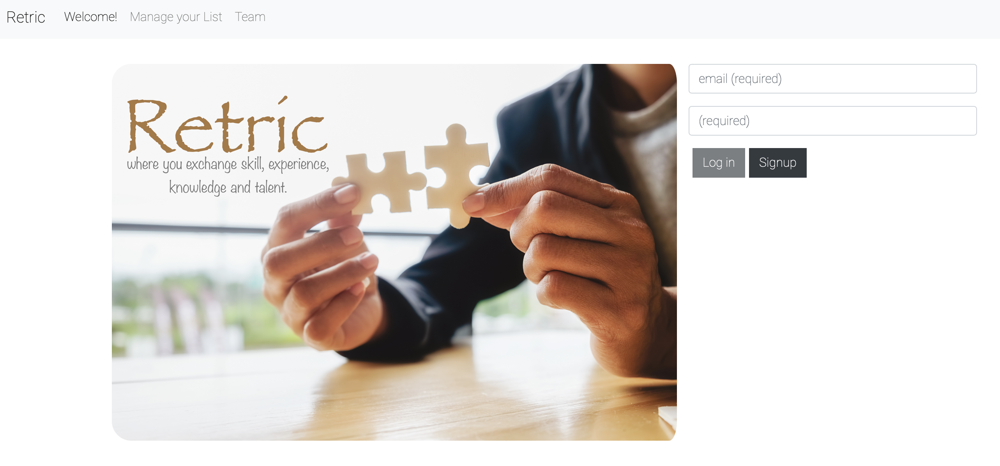
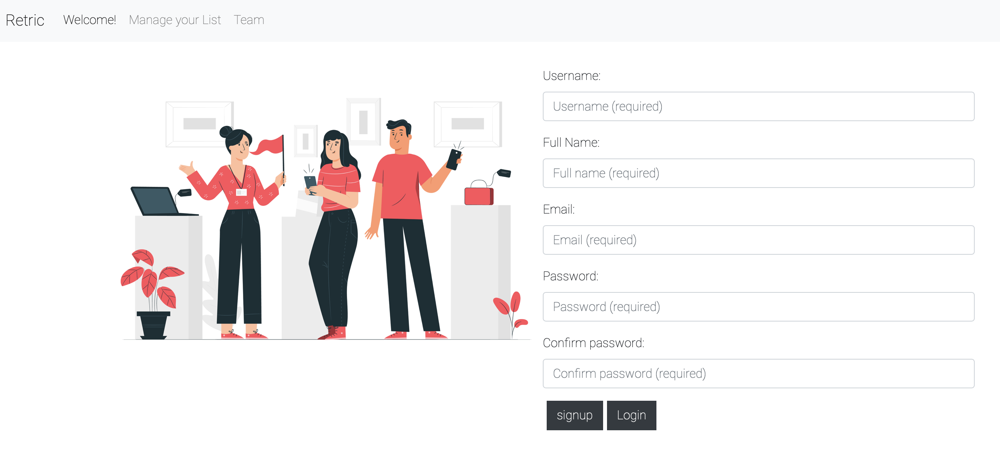
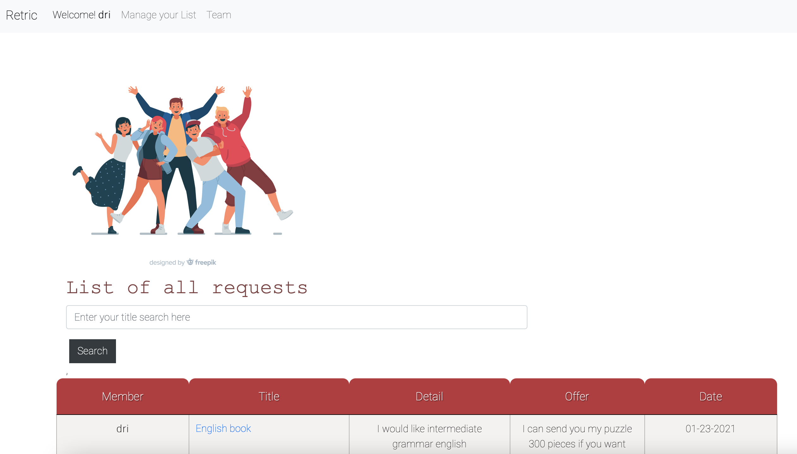
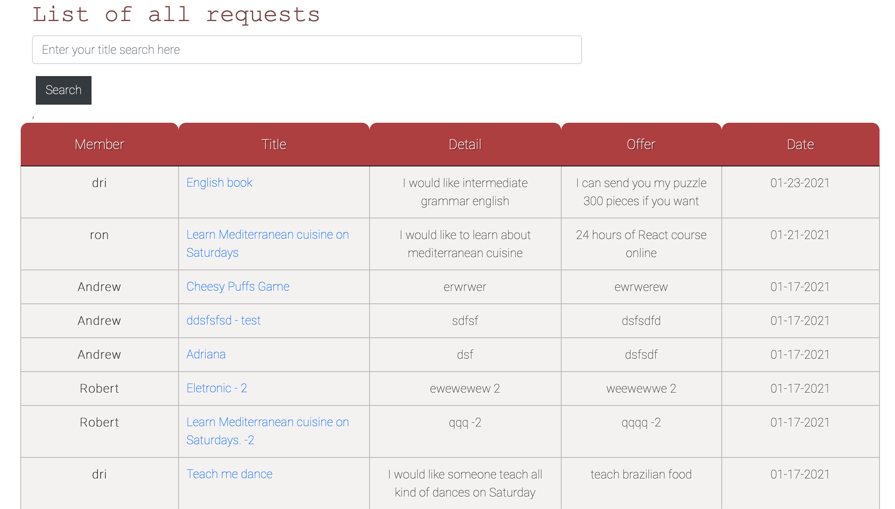
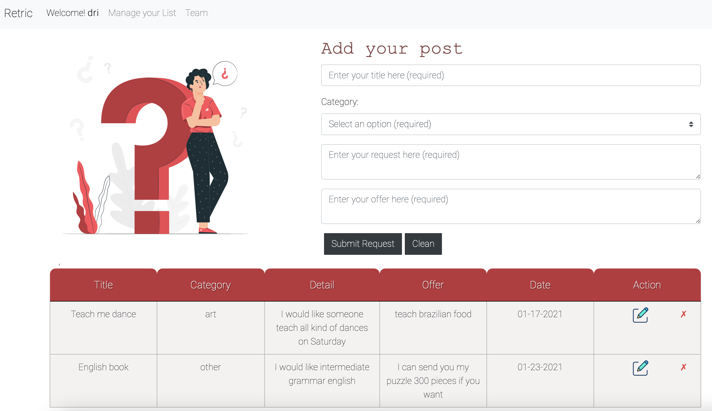
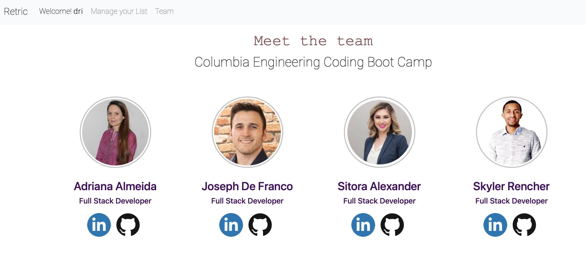

# Retric &#129309;
This was my final project at Full Stack BootCamp at Columbia University. It was developed in React with MongoDB. This project was built in collaboration with my group: Joseph de Franco, Sitora Alexander, Skyler Rencher.

### Purpose of the Retric Application
In this pandemic moment when many people have lost their jobs and need to qualify or even learn new things, this application was developed to help people exchange skills, experiences, knowledge and talents. Where each member can negotiate their needs and provide compensation. No money is not allowed! 

### Screenshots:

###### Home Page

========================
###### Sign up Page

========================
###### List of all Request Page
After successful login, the user is presented with a list of all requests. 

========================
List of all desire members

========================
###### Add Post Page

========================
###### Team Page



### Contributing:
- In most cases, please refer to this document: [Contributor Covenant](https://www.contributor-covenant.org/) 

- Please contact Adriana Almeida for collaboration.
- Please contact the owner.


### Questions:
If you have any questions, please feel free to reach me via Github or email below.

- [Github Profile](https://github.com/adriana-carmo)
- [Email Address](dri.abedala@gmail.com)


### 📦 M-E-R-N + passport box

<!-- ##### :earth_africa: [live]() on heroku -->

### 🍽 Use
-   Fork, or clone and copy what you need

### 🗃️ Folder structure


```
.
├── _assets                <- # project management assets
├── client                 <- # front end react app                        
│   ├── README.md          <- # create react app readme
│   ├── package.json       <- # create react app dev server (hot reloading)
│   ├── public             <- # front end static files 
│   │   ├── favicon.ico
│   │   ├── index.html
│   │   └── manifest.json
│   └── src                <- # font end source (can also place static files to be packed with webpack)
│       ├── App.js         <- # 🚀 react app entry point 
│       ├── components     <- # reusable components
│       │   ├── Card
│       │   ├── DeleteBtn
│       │   ├── Form
│       │   ├── Grid
│       │   ├── Head
│       │   ├── **ProtectedRoute** <- # protected routes (HOC)
│       │   └── Table
│       ├── index.js
│       ├── pages             <- # page components
│       ├── style.css
│       └── **utils**         <- # front end utils
│           ├── API.js        <- # coments routes front end api
│           ├── useLogPath.js <- # custom hook for development - logs current path
│           └── userAPI.js    <- # user routes front end api
├────────────────────────── **☝️ client 👇 server**
├── controllers               <- # routes function
│   ├── commentsController.js
│   └── userController.js
├── models                    <- # Schemas
│   ├── Comment.js
│   ├── User.js
│   └── index.js
├── routes                    <- # routes (only API routes)
│   ├── api
│   │   ├── comments.js
│   │   ├── index.js
│   │   └── user.js
│   └── index.js
├── utils                     <- # server helper functions 
│   ├── config.js             <- # global config (put anything you like)
│   ├── passport.js           <- # passport setup
│   └── seedDB.js             <- # seed script
├── package.json
├── readme.md
└── server.js                 <- # 🚀 entry point
```
